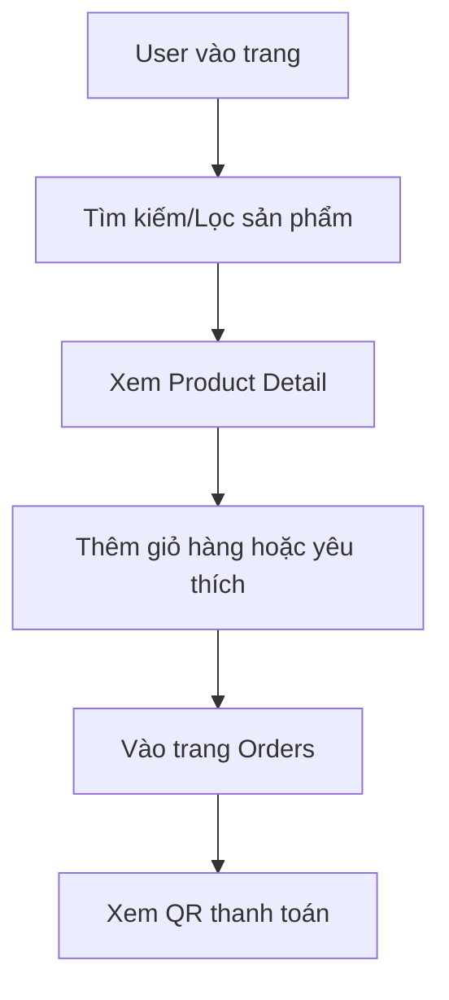
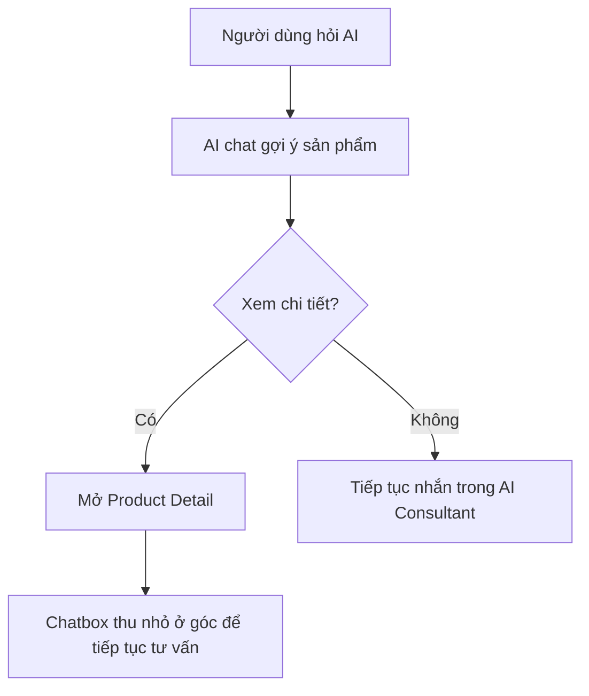
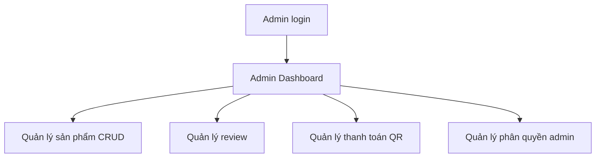

# PROJECT SUMMARY

## 1. Thông Tin Dự Án

- Tên đồ án: **Nexora Ecommerce + AI Shopping Assistant**
- Workspace: `nexora-workspace`
- Repository: `ecommerce/`
- Frontend: `ecommerce/fe` (React + Vite)
- Backend: `ecommerce/be` (Express + MongoDB + Mongoose)
- Cập nhật tài liệu: **2026-06-04**

Mục tiêu dự án:
1. Xây dựng website thương mại điện tử full-stack có thể vận hành được (catalog, auth, giỏ hàng, checkout UI, admin).
2. Tích hợp AI tư vấn mua hàng thực tế theo ngữ cảnh sản phẩm và giỏ hàng.
3. Tối ưu request flow để giảm spam/duplicate/rate-limit khi gọi AI model.
4. Mở rộng trải nghiệm mua sắm bằng hệ thống review/rating có thể tái sử dụng cho UI và AI.

---

## 2. Phạm Vi Và Chức Năng

### 2.1 Chức năng người dùng (Customer)

1. Đăng ký/đăng nhập tài khoản, xem và cập nhật thông tin cá nhân.
2. Tìm kiếm/lọc/xem chi tiết sản phẩm.
3. Thêm vào giỏ, yêu thích, so sánh.
4. Xem trang đặt hàng và QR thanh toán.
5. Gửi đánh giá sản phẩm theo số sao, viết nhận xét, sửa/xóa review của chính mình.
6. Xem điểm trung bình, breakdown rating và phần tóm tắt review trên trang chi tiết sản phẩm.
7. Quản lý khu vực tài khoản cá nhân: hồ sơ, bảo mật, địa chỉ, wishlist, đơn hàng, thông báo, giao diện và AI preferences.
8. Nhận tư vấn AI theo các kịch bản:
   - Chat tư vấn sản phẩm.
   - So sánh sản phẩm.
   - Hỏi AI về sản phẩm cụ thể.
   - AI phân tích giỏ hàng.

### 2.2 Chức năng quản trị (Admin)

1. CRUD sản phẩm.
2. Quản lý đơn ở mức giao diện admin.
3. Quản lý review sản phẩm: lọc, tìm kiếm, phân trang, xóa review.
4. Quản lý cấu hình thanh toán (bank info + QR image).
5. Quản lý phân quyền admin (super-admin cấp/thu hồi sub-admin).

### 2.3 Ngoài phạm vi hiện tại

1. Chưa có quy trình thanh toán cổng thật (VNPAY/MoMo/Stripe).
2. Chưa có pipeline CI/CD tự động trên cloud.
3. Chưa có bộ test tự động backend đầy đủ (unit/integration framework).
4. Chưa có order API backend hoàn chỉnh cho toàn bộ vòng đời đơn hàng.

---

## 3. Kiến Trúc Tổng Thể

### 3.1 System Context


### 3.2 Nguyên tắc kiến trúc

1. Frontend **không gọi AI trực tiếp**; mọi logic AI đi qua backend.
2. Backend lọc candidate sản phẩm trước, AI chỉ nhận top dữ liệu cần thiết.
3. Tách rõ các lớp: route -> controller -> service -> model.
4. Tối ưu mạng nhiều tầng: FE cache/dedupe + BE middleware cache/dedupe.
5. Dữ liệu review/rating được tổng hợp ở backend và tái sử dụng cho UI lẫn AI flow.

---

## 4. Cấu Trúc Mã Nguồn

```txt
ecommerce/
  fe/
    src/
      components/
      context/
      hooks/
      pages/
      services/
      utils/
  be/
    config/
    controllers/
    middleware/
    models/
    routes/
    services/
    seeders/
```

---

## 5. API Và Module Chính

### 5.1 Route map backend

1. `/api/test`
2. `/api/auth`
3. `/api/products`
4. `/api/payment-settings`
5. `/api/ai`
6. `/api/reviews`

### 5.2 Auth API

- `POST /api/auth/register`
- `POST /api/auth/login`
- `GET /api/auth/me`
- `PUT /api/auth/me/avatar`
- `GET /api/auth/me/avatar`
- `DELETE /api/auth/me/avatar`
- `GET /api/auth/admin-access` (super-admin)
- `POST /api/auth/admin-access/grant` (super-admin)
- `POST /api/auth/admin-access/revoke` (super-admin)

### 5.3 Product API

- `GET /api/products`
- `GET /api/products/:id`
- `POST /api/products` (admin)
- `PUT /api/products/:id` (admin)
- `DELETE /api/products/:id` (admin)

### 5.4 Payment setting API

- `GET /api/payment-settings`
- `GET /api/payment-settings/qr-image`
- `PUT /api/payment-settings` (super-admin)

### 5.5 AI API

- `POST /api/ai/chat`
- `POST /api/ai/compare`
- `POST /api/ai/product-explain`
- `POST /api/ai/cart-analyze`

### 5.6 Review API

- `GET /api/reviews` (admin)
- `GET /api/reviews/product/:productId`
- `POST /api/reviews/product/:productId`
- `PUT /api/reviews/:id`
- `DELETE /api/reviews/:id`

---

## 6. Workflow Nghiệp Vụ (Business Workflow)

### 6.1 Mua sắm cơ bản



### 6.2 Tư vấn AI trong hành trình mua sắm



### 6.3 Workflow quản trị



### 6.4 Workflow review sản phẩm


---

## 7. Workflow Kỹ Thuật (Request/Data Flow)

### 7.1 Chat AI recommendation


### 7.2 Product explain flow

1. FE gửi `productId` + câu hỏi.
2. BE validate `productId`, load product từ DB.
3. Service lấy thêm alternatives cùng category.
4. Gắn thêm `averageRating`, `totalReviews`, `reviewSummary` vào ngữ cảnh AI.
5. Gọi Gemini để tạo phần phân tích.
6. Chuẩn hóa JSON output; lỗi thì fallback an toàn.

### 7.3 Cart analyze flow

1. FE gửi `cartItems` và `userNeed`.
2. BE chuẩn hóa dữ liệu, sync sản phẩm từ DB.
3. Tạo suggestion pool theo category/compatibility.
4. Gọi AI để phân tích dư-thiếu-tối ưu.
5. Trả về `analysis` + `suggestionProducts`.

### 7.4 Review & rating flow

1. FE gọi `GET /api/reviews/product/:productId` để lấy danh sách review, aggregate và review của người đang xem.
2. Backend dùng `optionalAuthMiddleware` để nhận diện user nếu có token nhưng vẫn cho guest đọc review.
3. Với thao tác ghi, backend áp dụng `authMiddleware` + `reviewWriteRateLimit`.
4. Service validate 1 user chỉ có 1 review trên 1 sản phẩm, sanitize dữ liệu và cập nhật aggregate rating cho `Product`.
5. `reviewSummaryService` tạo hoặc làm mới phần tóm tắt review để frontend và AI dùng lại.

---

## 8. Quy Trình Phát Triển Phần Mềm (SDLC Áp Dụng)

Phương pháp áp dụng: **Iterative/Incremental theo sprint ngắn**, ưu tiên release sớm và cải tiến liên tục.

### 8.1 Giai đoạn 1 - Khởi tạo & Thu thập yêu cầu

1. Xác định bài toán: storefront + AI tư vấn.
2. Chốt phạm vi MVP: auth, catalog, detail, cart, ai consultant.
3. Xác định actor: customer, admin, super-admin.
4. Xác định công nghệ phù hợp cho đồ án.

Output:
- Danh sách yêu cầu chức năng/phi chức năng.
- Sơ đồ kiến trúc sơ bộ.

### 8.2 Giai đoạn 2 - Phân tích hệ thống

1. Phân rã module FE/BE/AI service.
2. Thiết kế luồng dữ liệu request-response.
3. Phân tích rủi ro rate-limit AI, spam request và spam review.

Output:
- API contract sơ bộ.
- Kế hoạch tối ưu request đa tầng.

### 8.3 Giai đoạn 3 - Thiết kế

1. Thiết kế DB schema (`User`, `Product`, `PaymentSetting`, `ProductReview`).
2. Thiết kế routing frontend và backend.
3. Thiết kế role model (`customer/admin/super-admin`).
4. Thiết kế UX các điểm chạm AI và review.

Output:
- Schema, route map, giao diện module.

### 8.4 Giai đoạn 4 - Cài đặt (Implementation)

1. FE: page/component/context/service theo domain.
2. BE: route-controller-service-model.
3. AI: intent analyzer, matching, recommend/compare/explain/cart.
4. Security: JWT auth, RBAC cho admin route, optional auth cho luồng đọc review.

Output:
- Source code chạy được end-to-end.

### 8.5 Giai đoạn 5 - Kiểm thử

1. Static check: `npm run lint` (frontend).
2. Build check: `npm run build`.
3. Syntax check backend bằng `node --check`.
4. API smoke test thủ công (Postman/FE flow).
5. Regression test theo user journey:
   - browse -> detail -> cart -> order
   - AI chat -> view detail -> continue chat
   - detail -> review -> cập nhật aggregate -> admin review

Output:
- Danh sách lỗi và bản vá theo vòng lặp.

### 8.6 Giai đoạn 6 - Triển khai nội bộ

1. Chạy local FE/BE theo script workspace.
2. Seed dữ liệu mẫu sản phẩm.
3. Cấu hình `.env` cho backend và FE.

Output:
- Môi trường demo/đánh giá đồ án ổn định.

### 8.7 Giai đoạn 7 - Bảo trì & cải tiến

1. Tối ưu intent/category guard.
2. Giảm lỗi AI 429 bằng cache/dedupe.
3. Cải thiện UX hội thoại (lưu session, thu nhỏ chatbox).
4. Mở rộng hệ thống review/rating cho các tình huống moderation sâu hơn nếu cần.

Output:
- Các bản cập nhật nhỏ, không phá kiến trúc chính.

---

## 9. Quy Trình Làm Việc Kỹ Thuật Hằng Ngày

### 9.1 Development workflow

1. Nhận yêu cầu hoặc bug.
2. Phân tích tác động (FE/BE/API/DB/AI).
3. Chỉnh code theo phạm vi nhỏ nhất.
4. Chạy lint/build/smoke flow liên quan.
5. Cập nhật tài liệu và handoff note.

### 9.2 Quy ước commit/branch (khuyến nghị cho báo cáo)

1. `feature/*`: phát triển chức năng mới.
2. `fix/*`: vá lỗi hoặc hồi quy.
3. `docs/*`: cập nhật tài liệu.
4. Commit theo ý nghĩa module: `fe: ...`, `be: ...`, `ai: ...`, `docs: ...`.

### 9.3 Tiêu chuẩn code đang áp dụng

1. FE lint bằng ESLint.
2. Tách logic service khỏi UI component.
3. Chuẩn hóa payload trước khi gọi API.
4. Trả lỗi thân thiện cho người dùng cuối.
5. Dùng reusable component cho rating (`StarRating`) và chuẩn hóa product payload có `rating`/`reviewSummary`.

---

## 10. Chiến Lược Kiểm Thử

### 10.1 Mức kiểm thử

1. Build verification: đảm bảo compile pass.
2. API contract test thủ công theo endpoint.
3. Functional test theo nghiệp vụ chính.
4. Regression test cho các luồng AI.
5. Regression test cho review/rating và quyền hạn người dùng.

### 10.2 Bộ case kiểm thử trọng tâm

1. Auth: đăng ký/đăng nhập/role guard.
2. Product: list/detail/CRUD admin.
3. Payment settings: update QR + lấy QR image.
4. AI chat: intent đúng category, trả candidate phù hợp.
5. Compare/Product explain/Cart analyze: trả JSON hợp lệ, có fallback.
6. Review: create/update/delete đúng quyền, aggregate rating cập nhật đúng, admin list hoạt động.

### 10.3 Rủi ro & giảm thiểu

1. AI rate-limit: xử lý bằng cache + dedupe + retry nhẹ.
2. Mất ngữ cảnh chat: lưu session storage.
3. Sai category recommendation: thêm category canonical mapping + guard.
4. Spam review: chặn ghi lặp trong thời gian ngắn bằng `reviewWriteRateLimit`.

---

## 11. Trạng Thái Chất Lượng Hiện Tại

Tại thời điểm **2026-06-04**:

1. `npm run lint` (FE): PASS.
2. `npm run build` (FE): PASS.
3. `node --check` trên các file backend đã sửa: PASS.
4. AI API 4 endpoint hoạt động qua middleware tối ưu.
5. Product CRUD có RBAC admin.
6. Payment setting + QR image endpoint hoạt động.
7. Hệ thống review/rating đã tích hợp end-to-end ở Product Detail, Product Card, Compare và AI flow.
8. Luồng AI -> bấm xem chi tiết -> chatbox thu nhỏ để tiếp tục tư vấn đã hoàn thiện.

---

## 12. Milestone Đã Hoàn Thành

1. Hoàn tất nền tảng FE/BE và kết nối MongoDB.
2. Hoàn tất auth + role model admin/super-admin.
3. Hoàn tất catalog và product CRUD.
4. Hoàn tất AI consultant đa endpoint.
5. Hoàn tất tối ưu request chống spam/duplicate.
6. Hoàn tất tích hợp AI entry point tại ProductDetail/Cart/Compare.
7. Hoàn tất UX giữ phiên tư vấn khi chuyển sang trang chi tiết sản phẩm.
8. Hoàn tất hệ thống Product Review & Rating, admin review management và AI-aware rating signals.

---

## 13. Kế Hoạch Phát Triển Tiếp Theo

1. Bổ sung test tự động backend (unit/integration) cho controller và AI services.
2. Chuẩn hóa module order thành API backend đầy đủ (create/list/status).
3. Tách logging và monitoring (request id, timing, error trace).
4. Tối ưu bundle frontend, đặc biệt các chunk lớn hơn 500kB sau build.
5. Triển khai CI cơ bản (lint + build + smoke API) trước khi merge.
6. Mở rộng cơ chế gợi ý AI theo lịch sử mua hàng thực tế.

---

## 14. Kết Luận

Dự án đã đạt mục tiêu của một hệ thống ecommerce có AI tư vấn ở mức đồ án tốt nghiệp: kiến trúc rõ ràng, luồng dữ liệu đầy đủ, có cơ chế tối ưu vận hành AI, và đã mở rộng thêm hệ thống review/rating để tăng độ tin cậy của trải nghiệm mua sắm lẫn chất lượng đầu vào cho AI. Tài liệu này có thể dùng trực tiếp cho phần **Workflow** và **Quy trình phát triển phần mềm** trong báo cáo.
