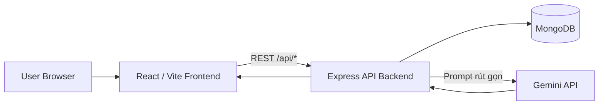
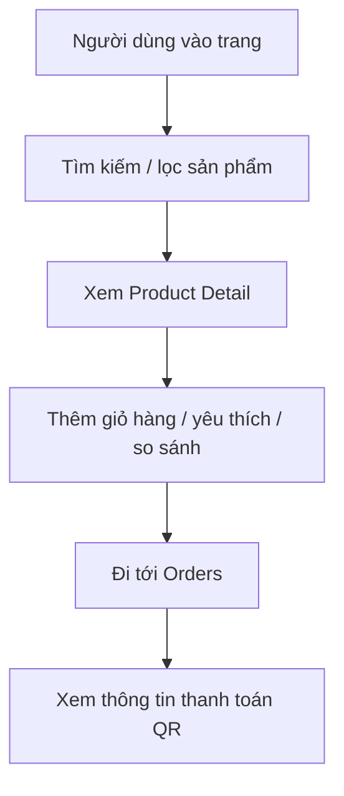
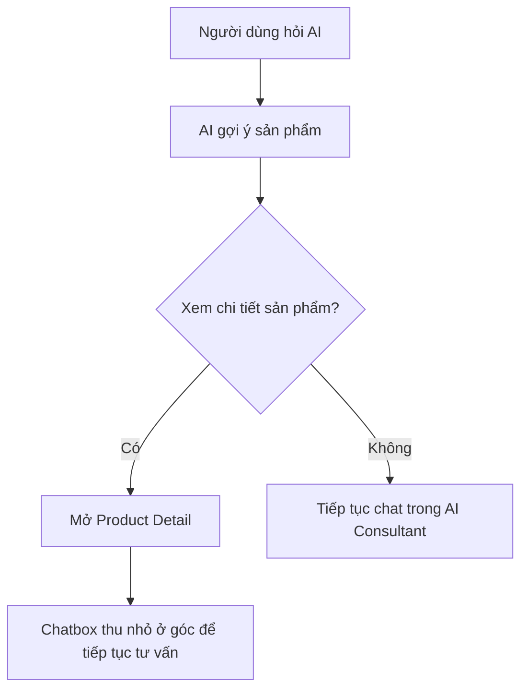
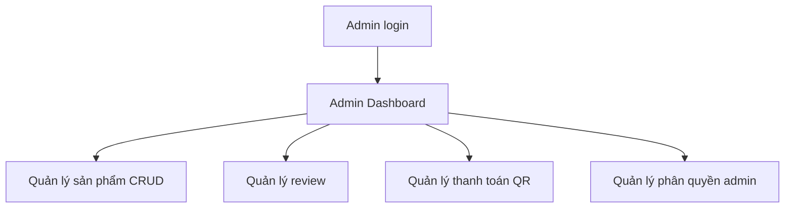
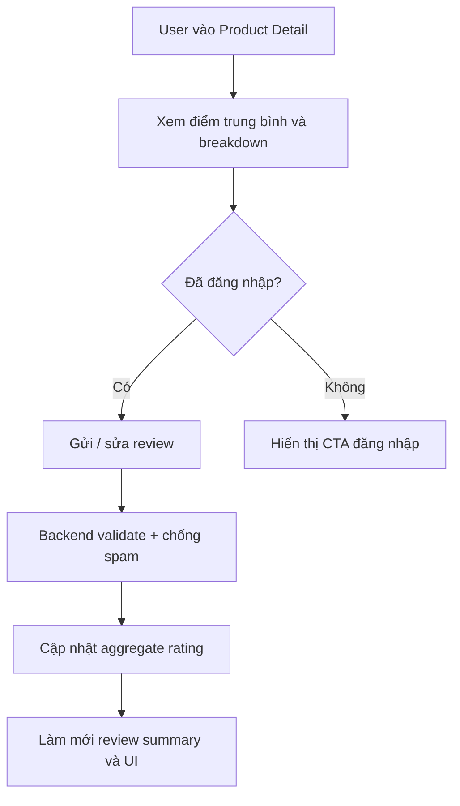

# PROJECT SUMMARY

## 1. Thông Tin Dự Án

- Tên đồ án: **Nexora Ecommerce + AI Shopping Assistant**
- Workspace: `ecommerce/`
- Frontend: `ecommerce/fe` (React + Vite)
- Backend: `ecommerce/be` (Express + MongoDB + Mongoose)
- Ngày cập nhật tài liệu: **2026-06-07**

### Mục tiêu dự án

1. Xây dựng hệ thống thương mại điện tử full-stack ở mức đồ án tốt nghiệp.
2. Tích hợp AI tư vấn mua sắm theo ngữ cảnh sản phẩm, giá, giỏ hàng và hành vi người dùng.
3. Tối ưu luồng request AI bằng cache, dedupe và chống spam để giảm tải backend.
4. Bổ sung review/rating end-to-end để tăng độ tin cậy cho trải nghiệm mua sắm và làm dữ liệu đầu vào cho AI.

---

## 2. Phạm Vi Và Chức Năng

### 2.1 Chức năng người dùng

1. Đăng ký, đăng nhập, đăng xuất.
2. Xem và cập nhật hồ sơ cá nhân.
3. Tìm kiếm, lọc và xem chi tiết sản phẩm.
4. Thêm sản phẩm vào giỏ hàng, danh sách yêu thích và danh sách so sánh.
5. Xem quy trình đặt hàng và màn hình thanh toán QR.
6. Gửi đánh giá sản phẩm, xem điểm trung bình và tóm tắt review.
7. Quản lý khu vực tài khoản cá nhân:
   - hồ sơ
   - địa chỉ
   - bảo mật
   - thông báo
   - giao diện
   - AI preferences
   - đơn hàng
   - wishlist
8. Tương tác với AI theo nhiều kịch bản:
   - Chat tư vấn sản phẩm
   - So sánh sản phẩm
   - Hỏi AI về một sản phẩm cụ thể
   - AI phân tích giỏ hàng

### 2.2 Chức năng quản trị

1. CRUD sản phẩm.
2. Quản lý đơn hàng ở mức giao diện quản trị.
3. Quản lý review: lọc, tìm kiếm, phân trang, xóa review.
4. Quản lý cấu hình thanh toán QR.
5. Quản lý phân quyền admin và super-admin.

### 2.3 Ngoài phạm vi hiện tại

1. Chưa tích hợp cổng thanh toán thật như VNPAY/MoMo/Stripe.
2. Chưa có pipeline CI/CD triển khai cloud hoàn chỉnh.
3. Chưa có bộ test tự động backend đầy đủ.
4. Luồng order ở backend chưa phải full lifecycle, hiện chủ yếu phục vụ mô hình demo/local storage và báo cáo đồ án.

---

## 3. Kiến Trúc Tổng Thể

### 3.1 System Context



### 3.2 Nguyên tắc kiến trúc

1. Frontend không gọi AI trực tiếp; mọi request AI đi qua backend.
2. Backend lọc và chuẩn hóa dữ liệu trước khi gọi model.
3. Tách rõ route, controller, service và model.
4. Tối ưu nhiều tầng:
   - FE cache/dedupe theo user
   - BE middleware chống spam, cache và request inflight
5. Dữ liệu review/rating được tổng hợp ở backend để tái sử dụng cho UI và AI flow.

### 3.3 Tổ chức dữ liệu phía FE

Hiện tại frontend đã tách trạng thái theo từng tài khoản cho các nhóm dữ liệu chính:

1. `cart`
2. `compare`
3. `favorites`
4. `theme`
5. `profile`, `addresses`, `notifications`, `AI preferences`, `appearance`, `security`
6. session của AI consultant và trạng thái thu nhỏ chatbox

Mục đích là tránh việc đăng nhập bằng tài khoản khác nhưng vẫn thấy dữ liệu của tài khoản trước.

---

## 4. Cấu Trúc Mã Nguồn

```txt
ecommerce/
  fe/
    src/
      assets/
      components/
      context/
      data/
      hooks/
      pages/
      services/
      utils/
  be/
    config/
    controllers/
    middleware/
    models/
    routes/
    seeders/
    services/
    utils/
```

### 4.1 FE module chính

1. `components/`: UI dùng lại như layout, product card, gallery, rating, AI widget.
2. `context/`: provider cho auth, cart, compare, favorites, theme, toast.
3. `pages/`: các trang public, account, admin và policy pages.
4. `services/`: logic gọi API, lưu trạng thái account, order, AI client cache.
5. `utils/`: format, product normalization, storage scope, timing, flash sale.

### 4.2 BE module chính

1. `controllers/`: xử lý request/response.
2. `middleware/`: auth, error handler, AI optimization.
3. `models/`: schema MongoDB.
4. `routes/`: khai báo route theo domain.
5. `services/`: matching, recommendation, compare, intent analysis, JSON utils, Gemini adapter.

---

## 5. API Và Module Chính

### 5.1 Route map backend

1. `/api/test`
2. `/api/auth`
3. `/api/products`
4. `/api/payment-settings`
5. `/api/ai`
6. `/api/reviews`

### 5.2 Auth API

- `POST /api/auth/register`
- `POST /api/auth/login`
- `GET /api/auth/me`
- `PUT /api/auth/me/avatar`
- `GET /api/auth/me/avatar`
- `DELETE /api/auth/me/avatar`
- `GET /api/auth/admin-access` (super-admin)
- `POST /api/auth/admin-access/grant` (super-admin)
- `POST /api/auth/admin-access/revoke` (super-admin)

### 5.3 Product API

- `GET /api/products`
- `GET /api/products/:id`
- `POST /api/products` (admin)
- `PUT /api/products/:id` (admin)
- `DELETE /api/products/:id` (admin)

### 5.4 Payment setting API

- `GET /api/payment-settings`
- `GET /api/payment-settings/qr-image`
- `PUT /api/payment-settings` (super-admin)

### 5.5 AI API

- `POST /api/ai/chat`
- `POST /api/ai/compare`
- `POST /api/ai/product-explain`
- `POST /api/ai/cart-analyze`

### 5.6 Review API

- `GET /api/reviews` (admin)
- `GET /api/reviews/product/:productId`
- `POST /api/reviews/product/:productId`
- `PUT /api/reviews/:id`
- `DELETE /api/reviews/:id`

---

## 6. Workflow Nghiệp Vụ

### 6.1 Workflow mua sắm cơ bản



### 6.2 Workflow AI trong hành trình mua sắm



### 6.3 Workflow quản trị



### 6.4 Workflow review sản phẩm



---

## 7. Workflow Kỹ Thuật

### 7.1 Luồng chat AI recommendation


### 7.2 Luồng AI product explain

1. FE gửi `productId` và câu hỏi.
2. BE validate `productId`, load sản phẩm từ MongoDB.
3. Service lấy thêm sản phẩm thay thế cùng category.
4. Gắn `averageRating`, `totalReviews`, `reviewSummary` vào ngữ cảnh AI.
5. Gọi Gemini để tạo phân tích.
6. Chuẩn hóa JSON output; nếu lỗi thì dùng fallback an toàn.

### 7.3 Luồng AI cart analyze

1. FE gửi `cartItems` và `userNeed`.
2. BE chuẩn hóa dữ liệu và map sản phẩm từ DB.
3. Tạo suggestion pool theo category và tính tương thích.
4. Gọi AI để phân tích dư - thiếu - tối ưu ngân sách.
5. Trả về `analysis`, `suggestionProducts` và `totalAmount`.

### 7.4 Luồng review & rating

1. FE gọi `GET /api/reviews/product/:productId` để lấy danh sách review và aggregate.
2. Backend dùng `optionalAuthMiddleware` để nhận diện user nếu có token nhưng vẫn cho guest đọc.
3. Khi ghi review, backend áp dụng auth và rate limit.
4. Service kiểm tra một user chỉ có một review trên một sản phẩm, đồng thời cập nhật rating tổng hợp.
5. `reviewSummaryService` tạo hoặc làm mới bản tóm tắt review để FE và AI dùng lại.

### 7.5 AI optimization middleware

Middleware áp dụng cho toàn bộ `/api/ai/*`:

1. Chuẩn hóa payload và tạo `cacheKey`.
2. Chặn spam theo IP trong khung thời gian ngắn.
3. Nếu có cache thì trả ngay.
4. Nếu request trùng đang xử lý thì dùng chung kết quả.
5. Nếu request mới thì đi tiếp vào controller và cache response sau khi thành công.

---

## 8. Quy Trình Phát Triển Phần Mềm (SDLC)

Phương pháp áp dụng: **Iterative / Incremental theo sprint ngắn**.

### 8.1 Giai đoạn 1 - Khởi tạo và thu thập yêu cầu

1. Xác định bài toán: ecommerce + AI shopping assistant.
2. Chốt phạm vi MVP: auth, catalog, detail, cart, AI consultant.
3. Xác định actor: customer, admin, super-admin.
4. Chọn stack và các thư viện hỗ trợ.

Output:

- Danh sách yêu cầu chức năng và phi chức năng.
- Sơ đồ kiến trúc sơ bộ.

### 8.2 Giai đoạn 2 - Phân tích hệ thống

1. Phân rã module FE / BE / AI services.
2. Xác định flow request-response.
3. Phân tích rủi ro spam AI, duplicate request, spam review.

Output:

- API contract sơ bộ.
- Kế hoạch tối ưu đa tầng.

### 8.3 Giai đoạn 3 - Thiết kế

1. Thiết kế schema MongoDB cho User, Product, PaymentSetting, Review và Order planned entity.
2. Thiết kế routing frontend và backend.
3. Thiết kế role model `customer/admin/super-admin`.
4. Thiết kế UX các điểm chạm AI và review.

Output:

- Schema, route map, giao diện module.

### 8.4 Giai đoạn 4 - Cài đặt

1. FE: page, component, context, service theo domain.
2. BE: route, controller, service, model.
3. AI: intent analyzer, product matching, compare, explain, cart analyze.
4. Security: JWT auth, RBAC cho admin route, optional auth cho luồng đọc review.

Output:

- Source code chạy end-to-end.

### 8.5 Giai đoạn 5 - Kiểm thử

1. Build verification FE.
2. API smoke test bằng Postman hoặc luồng FE thực tế.
3. Syntax check backend bằng `node --check`.
4. Regression test các luồng:
   - browse -> detail -> cart -> order
   - AI chat -> xem chi tiết -> tiếp tục chat
   - detail -> review -> cập nhật aggregate -> admin review

Output:

- Danh sách lỗi và bản vá theo vòng lặp.

### 8.6 Giai đoạn 6 - Triển khai nội bộ

1. Chạy local FE/BE theo workspace scripts.
2. Seed dữ liệu mẫu sản phẩm.
3. Cấu hình `.env` cho backend và frontend.

Output:

- Môi trường demo ổn định.

### 8.7 Giai đoạn 7 - Bảo trì và cải tiến

1. Tối ưu intent/category guard.
2. Giảm lỗi AI 429 bằng cache và dedupe.
3. Cải thiện UX hội thoại, lưu session và thu nhỏ chatbox khi chuyển trang.
4. Mở rộng hệ thống review/rating nếu cần moderation sâu hơn.

Output:

- Các bản cập nhật nhỏ, không phá kiến trúc chính.

---

## 9. Quy Trình Làm Việc Kỹ Thuật Hằng Ngày

### 9.1 Development workflow

1. Nhận yêu cầu hoặc bug.
2. Phân tích tác động FE / BE / API / DB / AI.
3. Chỉnh code theo phạm vi nhỏ nhất.
4. Chạy lint, build, smoke test liên quan.
5. Cập nhật tài liệu và handoff note.

### 9.2 Quy ước branch / commit

1. `feature/*`: phát triển chức năng mới.
2. `fix/*`: vá lỗi.
3. `docs/*`: cập nhật tài liệu.
4. Commit theo ý nghĩa module: `fe: ...`, `be: ...`, `ai: ...`, `docs: ...`.

### 9.3 Tiêu chuẩn code đang áp dụng

1. FE lint bằng ESLint.
2. Tách logic service khỏi UI component.
3. Chuẩn hóa payload trước khi gọi API.
4. Trả lỗi thân thiện cho người dùng cuối.
5. Dùng reusable component cho rating và chuẩn hóa dữ liệu sản phẩm có `rating` / `reviewSummary`.

---

## 10. Chiến Lược Kiểm Thử

### 10.1 Mức kiểm thử

1. Build verification.
2. API contract test thủ công.
3. Functional test theo nghiệp vụ chính.
4. Regression test cho các luồng AI.
5. Regression test cho review/rating và quyền hạn.

### 10.2 Bộ case kiểm thử trọng tâm

1. Auth: đăng ký, đăng nhập, role guard.
2. Product: list, detail, CRUD admin.
3. Payment settings: update QR và lấy QR image.
4. AI chat: intent đúng category, trả candidate phù hợp.
5. Compare / product explain / cart analyze: JSON hợp lệ, có fallback.
6. Review: create / update / delete đúng quyền, aggregate rating cập nhật đúng, admin list hoạt động.

### 10.3 Rủi ro và giảm thiểu

1. AI rate-limit: xử lý bằng cache + dedupe + retry nhẹ.
2. Mất ngữ cảnh chat: lưu session theo user.
3. Sai category recommendation: thêm canonical mapping và guard.
4. Spam review: chặn ghi lặp trong thời gian ngắn.

---

## 11. Trạng Thái Chất Lượng Hiện Tại

Tại thời điểm **2026-06-07**:

1. FE build: PASS.
2. FE lint: PASS theo trạng thái làm việc gần nhất đã kiểm tra trước đó.
3. Backend code đã được chuẩn hóa theo mô hình route - controller - service - model.
4. AI 4 endpoint hoạt động qua middleware tối ưu.
5. Product CRUD có RBAC admin.
6. Payment setting + QR image endpoint hoạt động.
7. Review/rating đã tích hợp end-to-end vào Product Detail, Product Card, Compare và AI flow.
8. Chatbox AI có thể thu nhỏ khi mở chi tiết sản phẩm để tiếp tục tư vấn.
9. Các state dùng chung phía FE đã được tách theo tài khoản cho cart, compare, favorites, theme, profile và AI session.
10. Checkout có box thông báo hoàn tất thanh toán và quay về trang chủ sau vài giây hoặc khi người dùng đóng box.
11. Admin order thao tác xác nhận bằng modal thay vì `alert`/`confirm` của trình duyệt.
12. Luồng hiển thị giá và trạng thái tồn kho ở Product Detail đã được sửa để tránh bị overwrite bởi dữ liệu review không đầy đủ.

---

## 12. Milestone Đã Hoàn Thành

1. Hoàn tất nền tảng FE/BE và kết nối MongoDB.
2. Hoàn tất auth và role model admin/super-admin.
3. Hoàn tất catalog và product CRUD.
4. Hoàn tất AI consultant đa endpoint.
5. Hoàn tất tối ưu request chống spam/duplicate.
6. Hoàn tất tích hợp AI entry point tại Product Detail, Cart và Compare.
7. Hoàn tất UX giữ phiên tư vấn khi chuyển sang trang chi tiết sản phẩm.
8. Hoàn tất hệ thống Product Review & Rating, admin review management và AI-aware rating signals.
9. Hoàn tất tách dữ liệu FE theo tài khoản để tránh dùng chung giữa các phiên đăng nhập.
10. Hoàn tất cải thiện checkout bằng box xác nhận thanh toán và điều hướng về trang chủ.
11. Hoàn tất xác nhận đơn hàng trong admin bằng modal rõ ràng hơn.
12. Hoàn tất sửa lỗi đồng nhất tên khách hàng bằng snapshot theo user khi tạo order.
13. Hoàn tất sửa lỗi Product Detail bị mất giá / hiểu sai hết hàng do dữ liệu review trả về thiếu field.

---

## 13. Kế Hoạch Phát Triển Tiếp Theo

1. Bổ sung test tự động backend cho controller và AI services.
2. Chuẩn hóa module order thành API backend đầy đủ nếu mở rộng scope.
3. Tách logging và monitoring theo request id, timing, error trace.
4. Tối ưu bundle frontend bằng code splitting các trang nặng.
5. Thiết lập CI cơ bản: lint + build + smoke API.
6. Mở rộng cơ chế gợi ý AI theo lịch sử mua hàng thực tế.

---

## 14. Kết Luận

Dự án Nexora Ecommerce + AI Shopping Assistant đã đạt mục tiêu của một hệ thống ecommerce có AI tư vấn ở mức đồ án tốt nghiệp: kiến trúc rõ ràng, luồng dữ liệu đầy đủ, có cơ chế tối ưu vận hành AI, có review/rating để tăng độ tin cậy và có cách tổ chức state phía frontend an toàn hơn theo từng tài khoản.

Tài liệu này có thể dùng trực tiếp cho phần **Workflow**, **Quy trình phát triển phần mềm**, **Kiến trúc hệ thống** và **Đánh giá trạng thái dự án** trong báo cáo đồ án.
