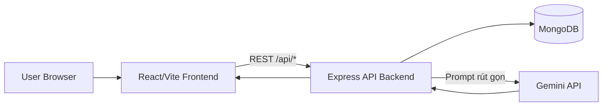
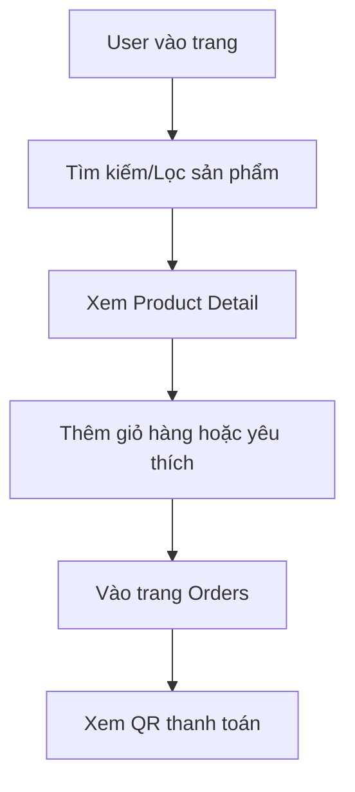
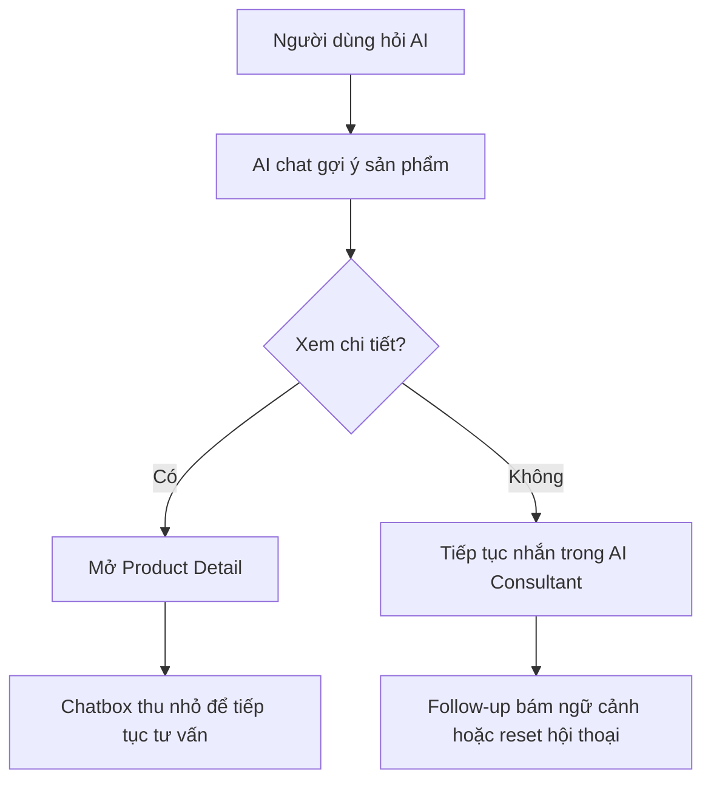
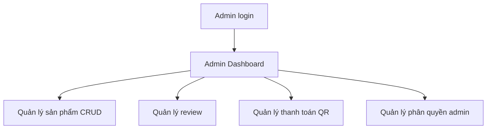
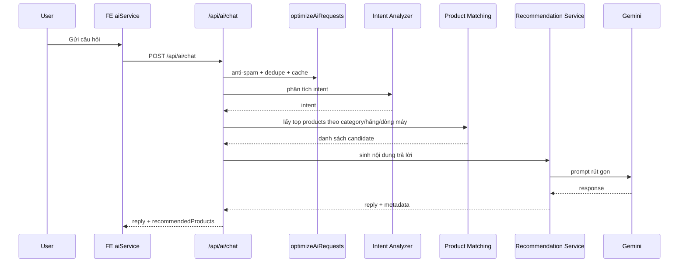

# PROJECT SUMMARY

## 1. Thông Tin Dự Án

- Tên đồ án: **Nexora Ecommerce + AI Shopping Assistant**
- Workspace: `nexora-workspace`
- Repository: `ecommerce/`
- Frontend: `ecommerce/fe` (React + Vite)
- Backend: `ecommerce/be` (Express + MongoDB + Mongoose)
- Cập nhật tài liệu: **2026-06-08**

### Mục tiêu

1. Xây dựng hệ thống thương mại điện tử full-stack chạy được end-to-end.
2. Tích hợp AI tư vấn mua sắm theo ngữ cảnh sản phẩm, giỏ hàng và lịch sử hội thoại.
3. Tối ưu request AI bằng cache, dedupe và chống spam/rate-limit.
4. Mở rộng trải nghiệm mua sắm bằng review/rating, compare và các màn AI hỗ trợ ra quyết định.

---

## 2. Phạm Vi Và Chức Năng

### 2.1 Chức năng người dùng

1. Đăng ký, đăng nhập, đăng xuất.
2. Xem và cập nhật hồ sơ cá nhân.
3. Tìm kiếm, lọc, xem danh sách và trang chi tiết sản phẩm.
4. Thêm vào giỏ hàng, yêu thích và so sánh.
5. Xem quy trình đặt hàng và màn hình thanh toán QR.
6. Gửi review, xem điểm trung bình, rating breakdown và review summary.
7. Quản lý khu vực tài khoản: hồ sơ, bảo mật, địa chỉ, wishlist, đơn hàng, thông báo, giao diện và AI preferences.
8. Tương tác với AI qua:
   - Chat tư vấn sản phẩm.
   - Follow-up theo ngữ cảnh hội thoại.
   - So sánh sản phẩm.
   - Hỏi AI về một sản phẩm cụ thể.
   - AI phân tích giỏ hàng.

### 2.2 Chức năng quản trị

1. CRUD sản phẩm.
2. Quản lý đơn hàng ở giao diện admin.
3. Quản lý review sản phẩm: lọc, tìm kiếm, phân trang, xóa review.
4. Quản lý thanh toán (bank info + QR image).
5. Quản lý phân quyền admin (super-admin cấp/thu hồi sub-admin).

### 2.3 Ngoài phạm vi hiện tại

1. Chưa tích hợp cổng thanh toán thật như VNPAY/MoMo/Stripe.
2. Chưa có CI/CD cloud hoàn chỉnh.
3. Chưa có bộ test backend đầy đủ cho toàn bộ domain.
4. Chưa có order API backend hoàn chỉnh cho toàn bộ vòng đời đơn hàng.

---

## 3. Kiến Trúc Tổng Thể

### 3.1 System Context



### 3.2 Nguyên Tắc Kiến Trúc

1. Frontend không gọi AI trực tiếp; mọi logic AI đi qua backend.
2. Backend lọc candidate sản phẩm trước, AI chỉ nhận dữ liệu cần thiết.
3. Tách rõ route -> controller -> service -> model.
4. Tối ưu nhiều tầng: FE cache/dedupe + BE middleware cache/dedupe.
5. Review/rating được tổng hợp ở backend và tái sử dụng cho UI lẫn AI.
6. Matching AI ưu tiên tín hiệu hãng/dòng máy để giảm trả sai sản phẩm cùng category.

---

## 4. Cấu Trúc Mã Nguồn

```txt
ecommerce/
  fe/
    src/
      components/
      context/
      hooks/
      pages/
      services/
      utils/
  be/
    config/
    controllers/
    middleware/
    models/
    routes/
    services/
    seeders/
```

---

## 5. API Và Module Chính

### 5.1 Route map backend

1. `/api/test`
2. `/api/auth`
3. `/api/products`
4. `/api/payment-settings`
5. `/api/ai`
6. `/api/reviews`
7. `/api/inventory`

### 5.2 AI API

- `POST /api/ai/chat`
- `POST /api/ai/compare`
- `POST /api/ai/product-explain`
- `POST /api/ai/cart-analyze`
- `GET /api/ai/inventory-insights`

### 5.3 Review API

- `GET /api/reviews`
- `GET /api/reviews/product/:productId`
- `POST /api/reviews/product/:productId`
- `PUT /api/reviews/:id`
- `DELETE /api/reviews/:id`

### 5.4 Inventory API

- `GET /api/inventory/dashboard`
- `GET /api/inventory/transactions`
- `POST /api/inventory/import`
- `POST /api/inventory/export`

---

## 6. Workflow Nghiệp Vụ

### 6.1 Mua sắm cơ bản



### 6.2 Tư vấn AI



### 6.3 Workflow quản trị



### 6.4 Workflow review


---

## 7. Workflow Kỹ Thuật

### 7.1 Chat AI recommendation



### 7.2 Product explain flow

1. FE gửi `productId` + câu hỏi.
2. BE validate `productId`, load product từ DB.
3. Service lấy thêm products thay thế cùng category.
4. Gắn `averageRating`, `totalReviews`, `reviewSummary` vào ngữ cảnh AI.
5. Gọi Gemini để tạo phân tích.
6. Chuẩn hóa JSON output; lỗi thì fallback an toàn.

### 7.3 Cart analyze flow

1. FE gửi `cartItems` và `userNeed`.
2. BE chuẩn hóa dữ liệu, sync sản phẩm từ DB.
3. Tạo suggestion pool theo category/compatibility.
4. Gọi AI để phân tích dư-thiếu-tối ưu.
5. Trả về `analysis` + `suggestionProducts`.

### 7.4 Review & rating flow

1. FE gọi `GET /api/reviews/product/:productId`.
2. Backend dùng `optionalAuthMiddleware` để nhận diện user nếu có token.
3. Với thao tác ghi, backend áp dụng `authMiddleware` + `reviewWriteRateLimit`.
4. Service validate 1 user chỉ có 1 review trên 1 sản phẩm và cập nhật aggregate rating cho `Product`.
5. `reviewSummaryService` tạo hoặc làm mới review summary để frontend và AI dùng lại.

---

## 8. Trạng Thái AI Hiện Tại

### 8.1 Chatbox

1. Hỗ trợ follow-up theo ngữ cảnh hội thoại.
2. Hỗ trợ reset hội thoại.
3. Trả lời có dấu tiếng Việt đầy đủ.
4. Giữ conversation context qua nhiều lượt hỏi.

### 8.2 Compare

1. Hỗ trợ `so sánh 2 cái đầu`.
2. Hỗ trợ `so sánh 2 cái cuối`.
3. Hỗ trợ `so sánh 4 cái đó`.
4. Output compare có format:
   - Tóm tắt
   - Mẫu nên chọn
   - Vì sao
   - Khi nào không nên mua

### 8.3 Matching theo hãng/dòng máy

1. Nhận diện tốt `MacBook`, `iPhone`, `AirPods`.
2. Nhận diện thêm các family phổ biến:
   - Laptop: ThinkPad, Legion, LOQ, XPS, Vivobook, Zenbook, Aspire, Pavilion, Omen...
   - Phone: Galaxy, Pixel, Redmi, POCO, OPPO, vivo...
   - Headphones: Sony WH/WF, JBL...
   - Peripherals: Logitech G/MX, Keychron...
3. Giảm nguy cơ trả sai sản phẩm cùng category nhưng khác hãng.

---

## 9. Quy Trình Phát Triển Phần Mềm

### 9.1 Development workflow

1. Nhận yêu cầu hoặc bug.
2. Phân tích tác động FE/BE/API/DB/AI.
3. Chỉnh code theo phạm vi nhỏ nhất.
4. Chạy lint/build/test liên quan.
5. Cập nhật tài liệu và handoff note.

### 9.2 Quy ước commit/branch

1. `feature/*`: phát triển chức năng mới.
2. `fix/*`: vá lỗi hoặc hồi quy.
3. `docs/*`: cập nhật tài liệu.
4. Commit theo module: `fe: ...`, `be: ...`, `ai: ...`, `docs: ...`.

### 9.3 Tiêu chuẩn code

1. FE lint bằng ESLint.
2. Tách logic service khỏi UI component.
3. Chuẩn hóa payload trước khi gọi API.
4. Trả lỗi thân thiện cho người dùng cuối.

---

## 10. Chiến Lược Kiểm Thử

### 10.1 Mức kiểm thử

1. Build verification.
2. API smoke test thủ công theo endpoint.
3. Functional test theo nghiệp vụ chính.
4. Regression test cho các luồng AI.
5. Regression test cho review/rating và quyền hạn người dùng.

### 10.2 Bộ case kiểm thử trọng tâm

1. Auth: đăng ký/đăng nhập/role guard.
2. Product: list/detail/CRUD admin.
3. Payment settings: update QR + lấy QR image.
4. AI chat: intent đúng category, follow-up đúng ngữ cảnh.
5. Compare/Product explain/Cart analyze: trả JSON hợp lệ, có fallback.
6. Review: create/update/delete đúng quyền, aggregate rating cập nhật đúng.

### 10.3 Rủi ro & giảm thiểu

1. AI rate-limit: cache + dedupe + retry nhẹ.
2. Mất ngữ cảnh chat: lưu session state.
3. Sai category recommendation: dùng canonical mapping + family matching.
4. Spam review: chặn ghi lặp trong thời gian ngắn bằng `reviewWriteRateLimit`.

---

## 11. Trạng Thái Chất Lượng Hiện Tại

Tại thời điểm **2026-06-08**:

1. `npm run lint` (FE): PASS.
2. `npm run build` (FE): PASS.
3. `npm test` backend: PASS.
4. `npm test` frontend: PASS.
5. AI API 4 endpoint hoạt động qua middleware tối ưu.
6. Product CRUD có RBAC admin.
7. Payment setting + QR image endpoint hoạt động.
8. Review/rating đã tích hợp end-to-end ở Product Detail, Product Card, Compare và AI flow.
9. AI chatbox đã có follow-up, compare theo ngữ cảnh, reset hội thoại và trả lời tiếng Việt có dấu.
10. Mega menu FE đã rút gọn để không tràn màn hình và chỉ giữ danh mục nổi bật.
11. Brand-family matching đã được mở rộng để ưu tiên đúng dòng máy/hãng.

---

## 12. Milestone Đã Hoàn Thành

1. Hoàn tất nền tảng FE/BE và kết nối MongoDB.
2. Hoàn tất auth + role model admin/super-admin.
3. Hoàn tất catalog và product CRUD.
4. Hoàn tất AI consultant đa endpoint.
5. Hoàn tất tối ưu request chống spam/duplicate.
6. Hoàn tất tích hợp AI entry point tại ProductDetail/Cart/Compare.
7. Hoàn tất UX giữ phiên tư vấn khi chuyển sang trang chi tiết sản phẩm.
8. Hoàn tất hệ thống Product Review & Rating, admin review management và AI-aware rating signals.
9. Hoàn tất brand-family matching cho nhiều dòng máy phổ biến.

---

## 13. Kế Hoạch Phát Triển Tiếp Theo

1. Bổ sung test tự động backend (unit/integration) cho controller và AI services.
2. Chuẩn hóa module order thành API backend đầy đủ (create/list/status).
3. Tách logging và monitoring (request id, timing, error trace).
4. Tối ưu bundle frontend, đặc biệt các chunk lớn hơn 500kB sau build.
5. Triển khai CI cơ bản (lint + build + smoke API) trước khi merge.
6. Mở rộng cơ chế gợi ý AI theo lịch sử mua hàng thực tế.

---

## 14. Kết Luận

Dự án Nexora Ecommerce + AI Shopping Assistant đã đạt mục tiêu của một hệ thống ecommerce có AI tư vấn ở mức đồ án tốt nghiệp: kiến trúc rõ ràng, luồng dữ liệu đầy đủ, có cơ chế tối ưu vận hành AI, có review/rating để tăng độ tin cậy và có khả năng tư vấn theo ngữ cảnh hội thoại nhiều lượt. Tài liệu này có thể dùng trực tiếp cho phần workflow, kiến trúc hệ thống và quy trình phát triển phần mềm trong báo cáo.
