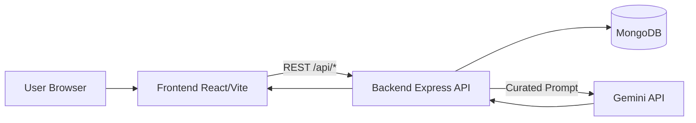
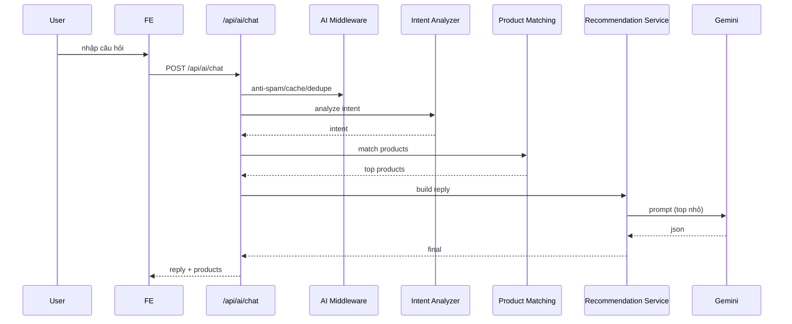
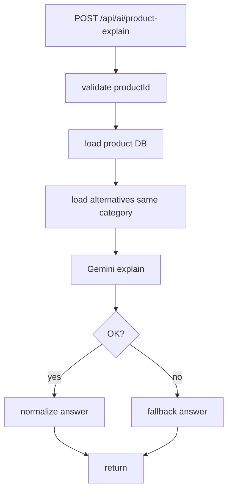
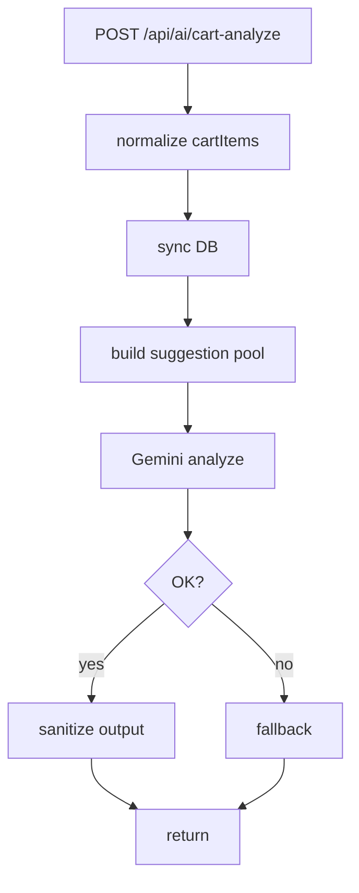

# PROJECT SUMMARY

## 1. Tổng Quan Dự Án

- Tên workspace: `nexora-workspace`
- Repo chính: `ecommerce/`
- Frontend: `ecommerce/fe` (React + Vite)
- Backend: `ecommerce/be` (Express + MongoDB + Mongoose)
- Branding storefront: `Nexora`
- Cập nhật tài liệu lần này: **2026-05-27**

Mục tiêu chính:
1. Vận hành storefront ecommerce hoàn chỉnh (responsive + dark mode + account/admin).
2. Triển khai AI Shopping Assistant thực tế (chat/recommend/compare/product/cart).
3. Ổn định request flow để giảm spam/429 và dùng Gemini free-tier bền hơn.

---

## 2. Trạng Thái Hiện Tại (As-Is)

### 2.1 Đang chạy ổn

1. Product CRUD backend-first qua MongoDB.
2. AI API đầy đủ 4 route:
   - `POST /api/ai/chat`
   - `POST /api/ai/compare`
   - `POST /api/ai/product-explain`
   - `POST /api/ai/cart-analyze`
3. FE + BE đã có dedupe/cache/chống spam request.
4. `npm run lint` pass.
5. `npm run build` pass.
6. Đã fix lỗi lẫn category (ví dụ hỏi điện thoại/âm thanh/phụ kiện bị lòi laptop/macbook).

### 2.2 Cập nhật nóng 2026-05-27

1. Sửa logic category query/matching để map category không dấu -> category có dấu trong DB.
2. Sửa intent rule:
   - bỏ keyword mơ hồ `phone` khỏi nhóm điện thoại (tránh match nhầm `headphone`).
   - thêm `headphone/earbud/airpods` vào nhóm âm thanh.
   - bỏ `khong day` khỏi rule âm thanh để không nuốt mất `chuot khong day`.
3. Thêm AI entry point trực tiếp trên UI:
   - ProductDetail: nút **Hỏi AI về sản phẩm này**.
   - Cart: nút **AI phân tích giỏ hàng**.

---

## 3. Kiến Trúc Tổng Thể

## 3.1 System Context



## 3.2 Nguyên tắc

1. Không gọi Gemini trực tiếp từ frontend.
2. Không gửi full DB cho AI.
3. Backend lọc candidate trước, Gemini chỉ nhận top nhỏ.
4. Ưu tiên fix theo scope nhỏ, không phá flow đang ổn.

---

## 4. Cấu Trúc Thư Mục

```txt
ecommerce/
  fe/
    src/
      components/
      context/
      hooks/
      pages/
      services/
      utils/
  be/
    config/
    controllers/
    middleware/
    models/
    routes/
    seeders/
    services/
```

---

## 5. Backend Architecture

## 5.1 Route map

File: `be/server.js`

1. `/api/test`
2. `/api/auth`
3. `/api/products`
4. `/api/payment-settings`
5. `/api/ai`

## 5.2 AI routes

Files:
- `be/routes/aiRoutes.js`
- `be/controllers/aiController.js`

Endpoints:
1. `POST /api/ai/chat`
2. `POST /api/ai/compare`
3. `POST /api/ai/product-explain`
4. `POST /api/ai/cart-analyze`

Middleware:
- `be/middleware/aiOptimizationMiddleware.js` bọc `/api/ai/*`.

## 5.3 Product model

File: `be/models/Product.js`

1. `name`, `category`, `price`, `stock` (required)
2. `brand`, `description`, `image`, `images[]`
3. `specs[]`, `tags[]`, `useCases[]`
4. `searchableText`
5. `timestamps`

---

## 6. AI Service Map

1. `be/services/aiIntentAnalyzerService.js`
2. `be/services/productMatchingService.js`
3. `be/services/aiRecommendationService.js`
4. `be/services/aiCompareService.js`
5. `be/services/aiProductService.js`
6. `be/services/geminiService.js`
7. `be/services/aiJsonUtils.js`

Vai trò:
1. Intent analyzer: parse category/budget/use-case/priorities/brand.
2. Matching: query + scoring + sort + gating theo category/avoid-brand.
3. Recommendation: trả lời chat ngắn gọn, tự nhiên.
4. Compare/Product/Cart: DB-first + fallback an toàn.
5. Gemini service: retry/backoff/cache/dedupe.

---

## 7. AI Request Optimization

## 7.1 Frontend (`fe/src/services/aiService.js`)

1. Normalize payload + giới hạn context:
   - message <= 600 chars
   - recent messages <= 8
   - compare ids <= 5
2. Inflight dedupe theo request key.
3. Memory cache + localStorage cache.
4. Timeout request 30s.
5. Friendly message cho 429.

## 7.2 Backend middleware (`be/middleware/aiOptimizationMiddleware.js`)

1. Rate-limit nhẹ theo IP/route.
2. Duplicate payload detection theo time window.
3. Inflight dedupe cấp API.
4. Response cache TTL ngắn.

## 7.3 Gemini (`be/services/geminiService.js`)

1. Retry tối đa 1 lần cho lỗi rate-limit.
2. Exponential backoff nhẹ.
3. Prompt cache + inflight dedupe.

---

## 8. Workflow AI

## 8.1 Chat recommendation



## 8.2 Product explain



## 8.3 Cart analyze



---

## 9. Matching & Category Guard (Mới)

Trọng tâm sửa để không lẫn sản phẩm:

1. Category canonical mapping trong `productMatchingService`:
   - `Dien thoai` -> `Điện thoại`
   - `Am thanh` -> `Âm thanh`
   - `Phu kien` -> `Phụ kiện`
   - `May tinh bang` -> `Máy tính bảng`
   - `Man hinh` -> `Màn hình`
   - `Noi that` -> `Nội thất`
   - `Laptop` -> `Laptop`
2. Query theo category dùng cả raw + canonical + searchableText.
3. Nếu query category ra rỗng, fallback lấy candidate toàn kho rồi **lọc chặt lại theo category match**.
4. Intent keyword tránh đè sai category (`phone` vs `headphone`).

Kết quả: giảm lỗi “hỏi category A ra sản phẩm category B”.

---

## 10. Frontend UX & Entry Points

## 10.1 AIConsultant

- Route: `/ai-consultant`
- Có conversational flow + recommendation cards + context memory.

## 10.2 ProductDetail

File: `fe/src/pages/ProductDetail.jsx`

- Có nút **Hỏi AI về sản phẩm này**.
- Gọi `POST /api/ai/product-explain` qua `explainProductWithAi`.
- Truyền `productId` hiện tại + câu hỏi mặc định.
- Có loading/error/result card.
- Không ảnh hưởng add cart/favorite/compare/mua ngay.

## 10.3 Cart

File: `fe/src/pages/Cart.jsx`

- Có nút **AI phân tích giỏ hàng**.
- Gọi `POST /api/ai/cart-analyze` qua `analyzeCartWithAi`.
- Truyền `cartItems` (`productId`, `quantity`) + `userNeed` mặc định.
- Có loading/error/result card.
- Không ảnh hưởng tăng/giảm/xóa item/checkout.

## 10.4 Compare

File: `fe/src/components/CompareTray.jsx`

- Có AI compare block.
- Guard dưới 2 sản phẩm thì không gọi API.

---

## 11. API Contract Tóm Tắt

## 11.1 `POST /api/ai/chat`

Request:
```json
{
  "message": "toi muon dien thoai duoi 20 trieu",
  "context": { "cartItems": [], "favoriteItems": [], "aiPreferences": {} },
  "conversationContext": {},
  "recentMessages": [],
  "conversationSummary": ""
}
```

Response:
```json
{
  "reply": "string",
  "intent": {},
  "recommendedProducts": [],
  "bestProductId": "string",
  "needMoreInfo": false,
  "followUpQuestion": ""
}
```

## 11.2 `POST /api/ai/compare`

Request:
```json
{
  "productIds": ["id1", "id2"],
  "focus": { "question": "so sanh cho hoc tap" }
}
```

## 11.3 `POST /api/ai/product-explain`

Request:
```json
{
  "productId": "mongoObjectId",
  "question": "Sản phẩm này có đáng mua không?"
}
```

## 11.4 `POST /api/ai/cart-analyze`

Request:
```json
{
  "cartItems": [{ "productId": "mongoObjectId", "quantity": 1 }],
  "userNeed": "Tôi muốn kiểm tra giỏ hàng này có hợp lý không"
}
```

---

## 12. Test Kết Quả Gần Nhất

Ngày test: **2026-05-27**

1. Lint: `npm run lint` -> **PASS**.
2. Build: `npm run build` -> **PASS**.
3. Smoke API:
   - `/api/ai/product-explain` -> OK
   - `/api/ai/cart-analyze` -> OK
   - `/api/ai/compare` -> OK
4. Category isolation test matrix 21 câu hỏi đa danh mục -> **TOTAL_FAIL=0**.
5. Case ngoài danh mục (`toi can may anh chup hinh`) -> không trả bừa sản phẩm, `needMoreInfo=true`.

---

## 13. Handoff Notes

1. Nếu chỉnh AI logic, ưu tiên ở backend service, không dồn sang FE.
2. Giữ schema response ổn định để Consultant/ProductDetail/Cart/Compare dùng chung.
3. Khi thêm sản phẩm mới, điền đủ `brand/tags/useCases/specs/searchableText` để matching tốt.
4. Nếu cần giảm quota Gemini thêm, hạ limit candidate ở `matchProductsByIntent` và giữ temperature thấp.
