# Sơ đồ phân cấp chức năng và workflow dự án Nexora

Tài liệu này tổng hợp từ cấu trúc mã nguồn hiện tại của dự án `ecommerce`, gồm frontend React/Vite và backend Express/MongoDB.

## 1. Tổng quan hệ thống

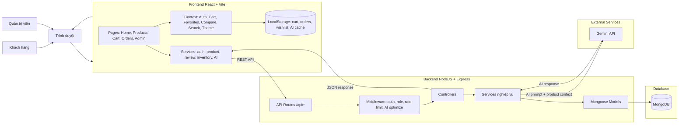

## 2. Sơ đồ phân cấp chức năng

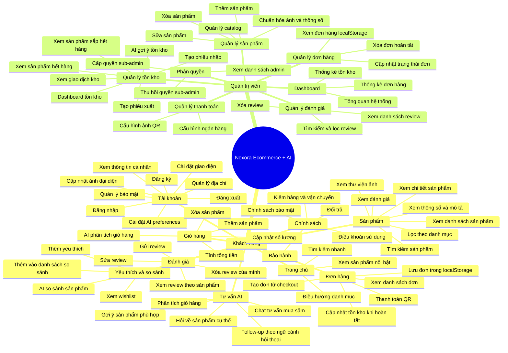

## 3. Phân rã module theo tầng

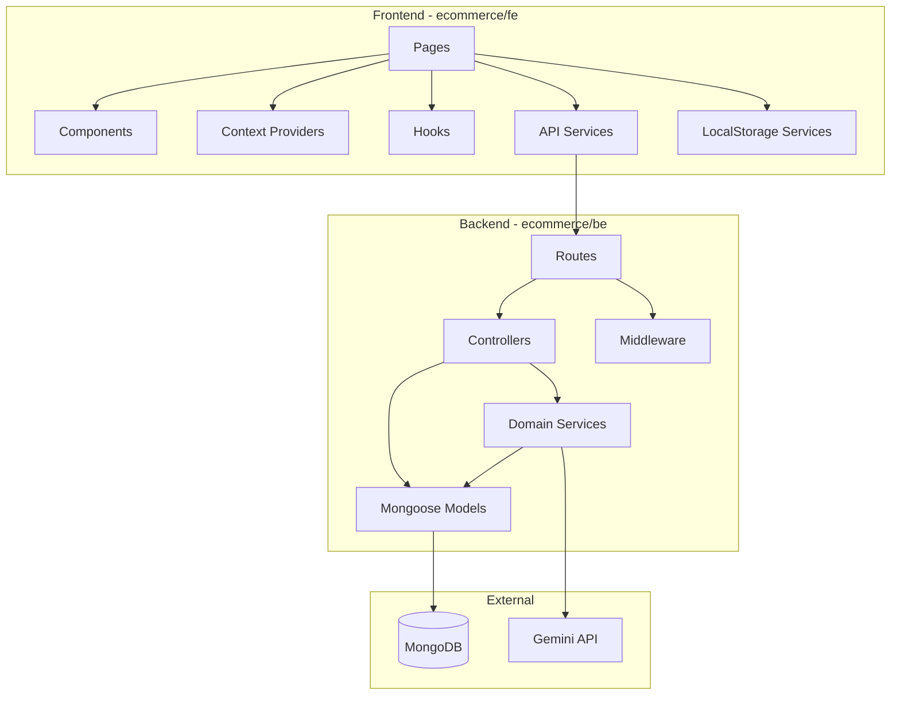

## 4. Route map chính

| Nhóm | Frontend route | Backend API |
| --- | --- | --- |
| Trang chủ | `/` | `GET /api/products` |
| Sản phẩm | `/products`, `/products/:id` | `GET /api/products`, `GET /api/products/:id` |
| Auth | `/login`, `/register`, `/account/*` | `/api/auth/*` |
| Giỏ hàng | `/cart` | `POST /api/orders/consume-stock` khi hoàn tất |
| Đơn hàng | `/orders`, `/orders/qr-payment` | hiện lưu chính ở localStorage |
| AI | `/ai-consultant`, widget trong UI | `/api/ai/chat`, `/compare`, `/product-explain`, `/cart-analyze` |
| Admin | `/admin/*` | `/api/products`, `/api/reviews`, `/api/inventory`, `/api/payment-settings`, `/api/auth/admin-access` |
| Review | Product detail, admin reviews | `/api/reviews/*` |
| Tồn kho | `/admin/inventory/*` | `/api/inventory/*` |

## 5. Workflow mua hàng

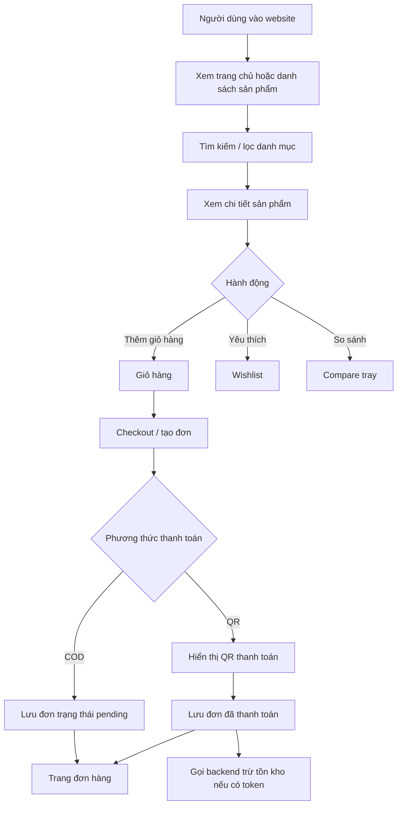

Ghi chú: đơn hàng hiện được quản lý chủ yếu bằng `localStorage` ở frontend; backend có API `POST /api/orders/consume-stock` để ghi nhận xuất kho theo đơn.

## 6. Workflow đăng ký / đăng nhập

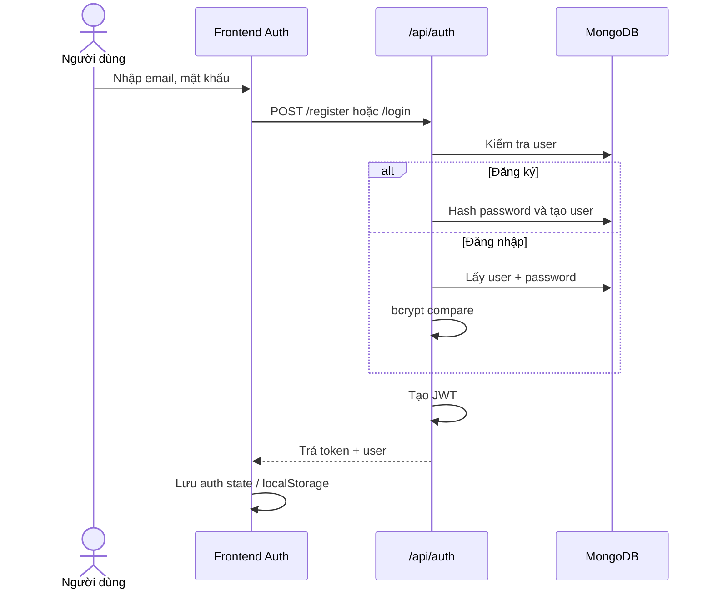

## 7. Workflow tư vấn AI

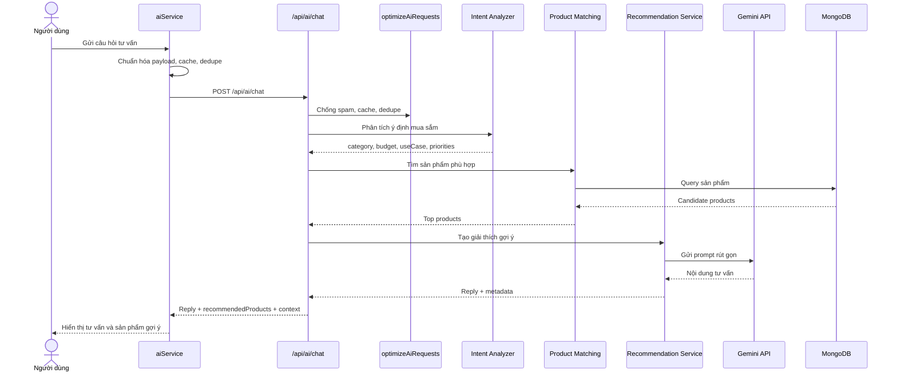

## 8. Workflow review sản phẩm

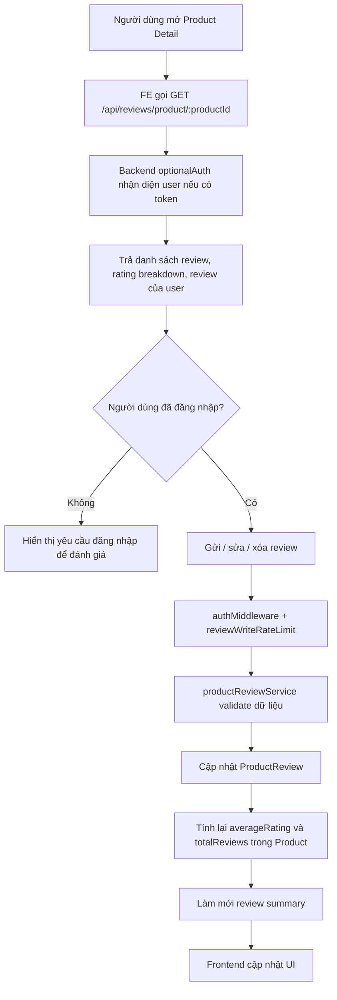

## 9. Workflow quản trị sản phẩm

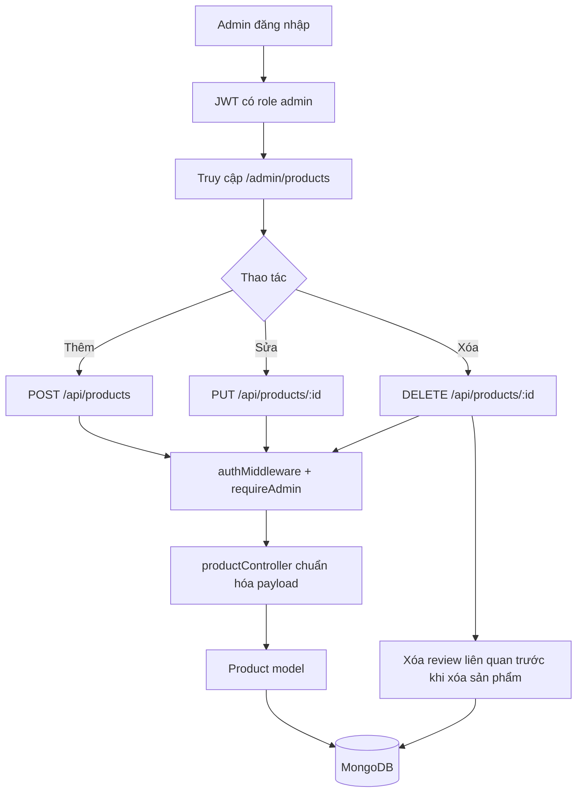

## 10. Workflow quản lý tồn kho

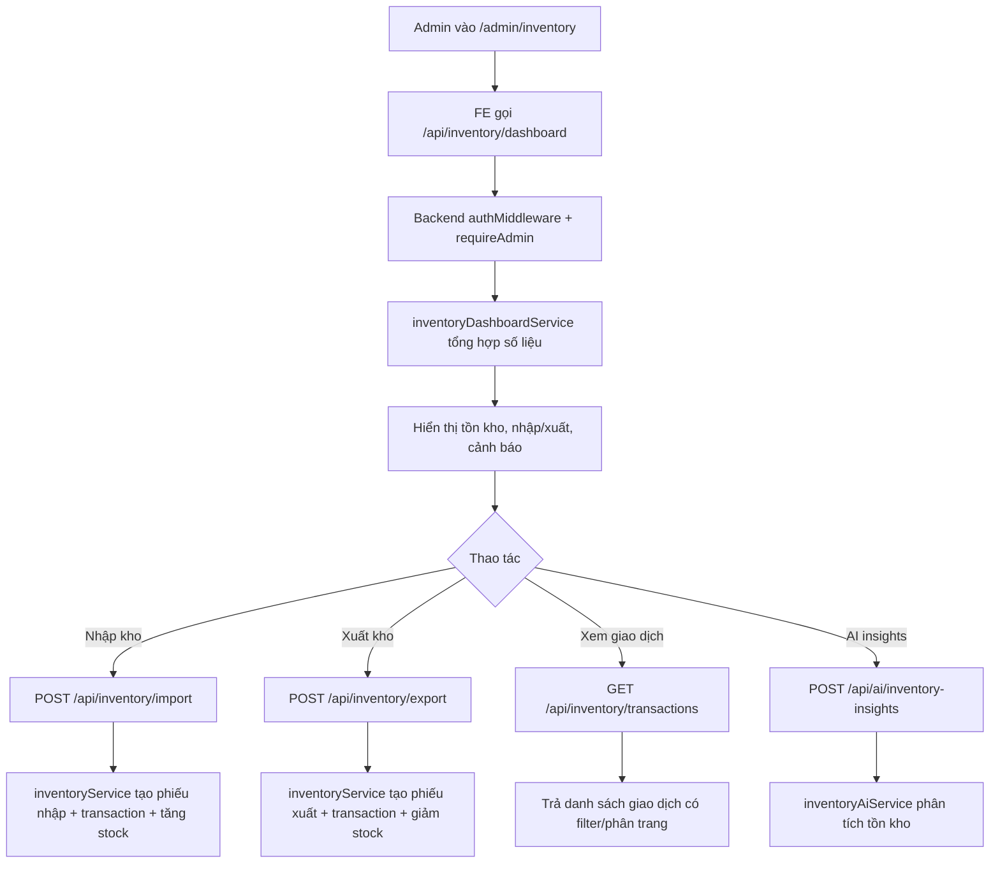

## 11. Workflow phân quyền admin

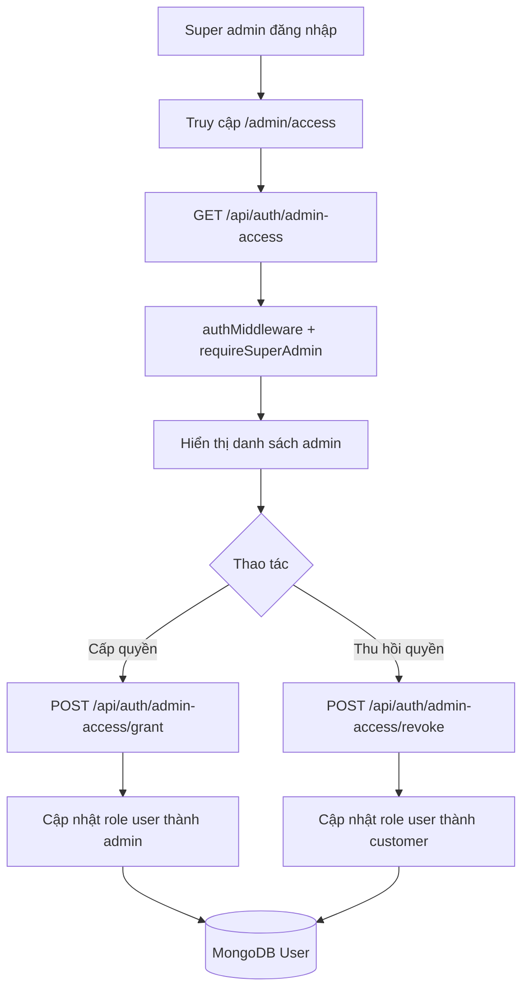

## 12. Các tác nhân và quyền

| Tác nhân | Quyền chính |
| --- | --- |
| Khách chưa đăng nhập | Xem sản phẩm, tìm kiếm, xem chính sách, chat AI cơ bản |
| Customer | Quản lý tài khoản, giỏ hàng, wishlist, đơn hàng local, review, AI theo ngữ cảnh cá nhân |
| Admin | CRUD sản phẩm, quản lý review, đơn hàng, tồn kho |
| Super admin | Toàn quyền admin, quản lý thanh toán, cấp/thu hồi quyền admin |

## 13. Luồng dữ liệu chính

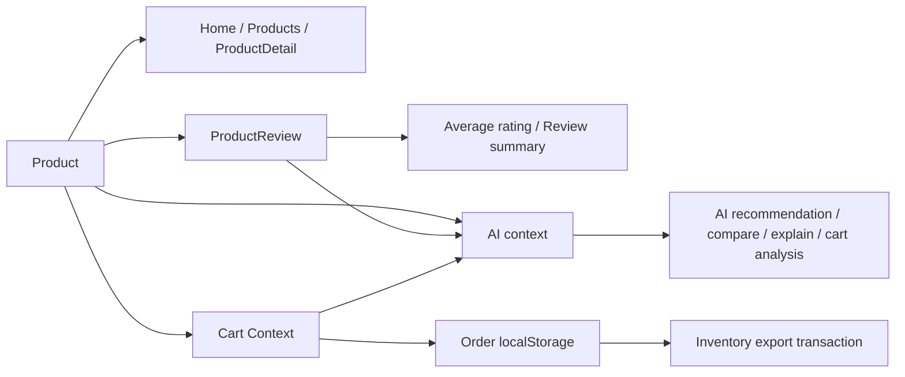
